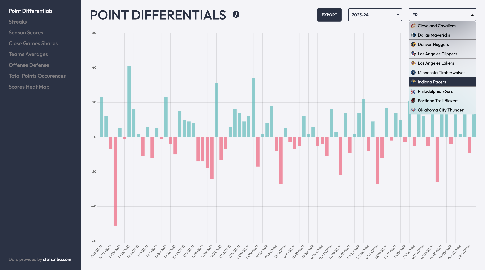
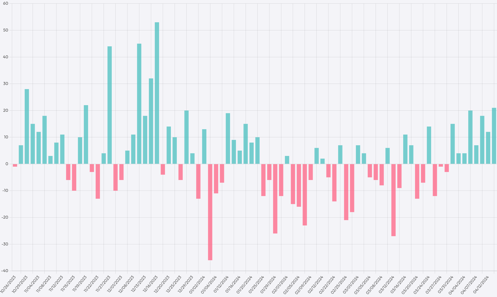
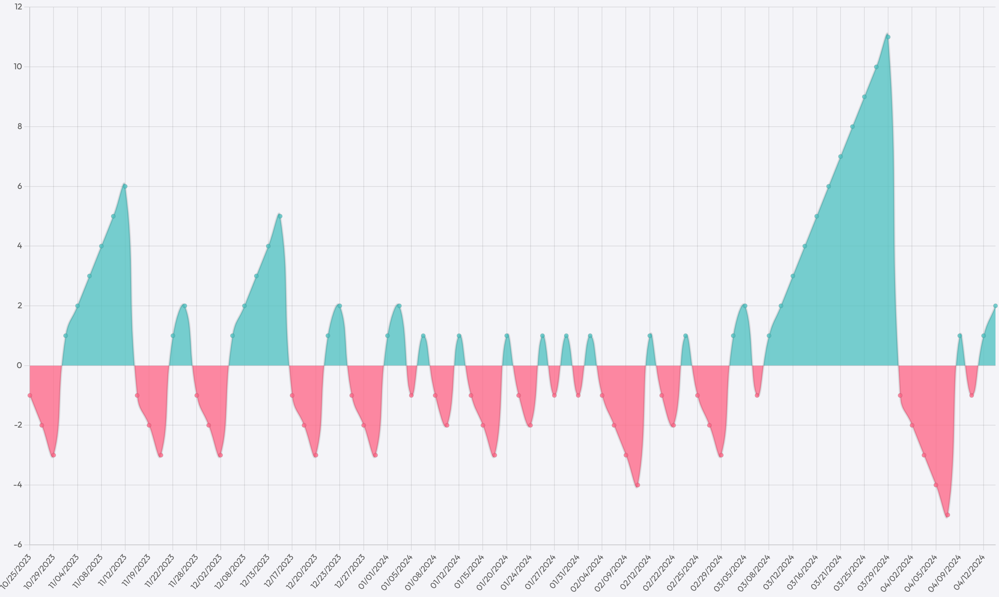
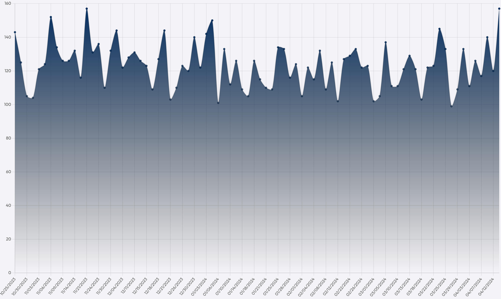
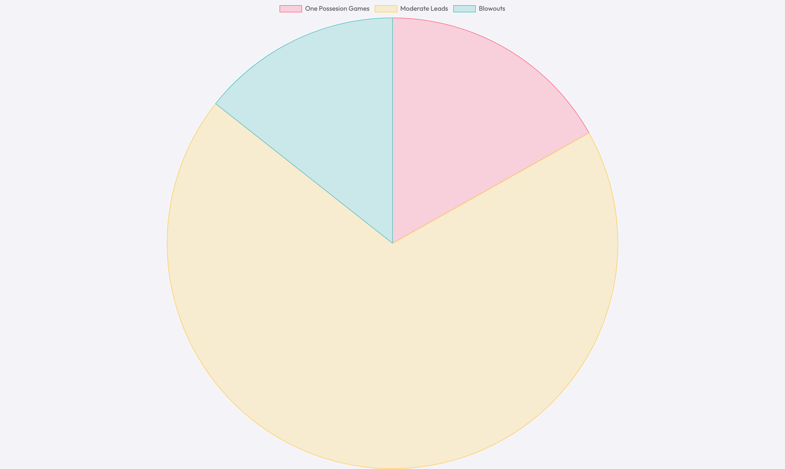
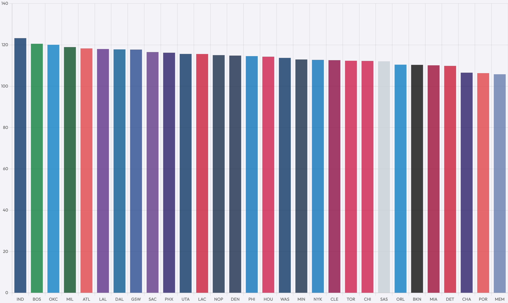
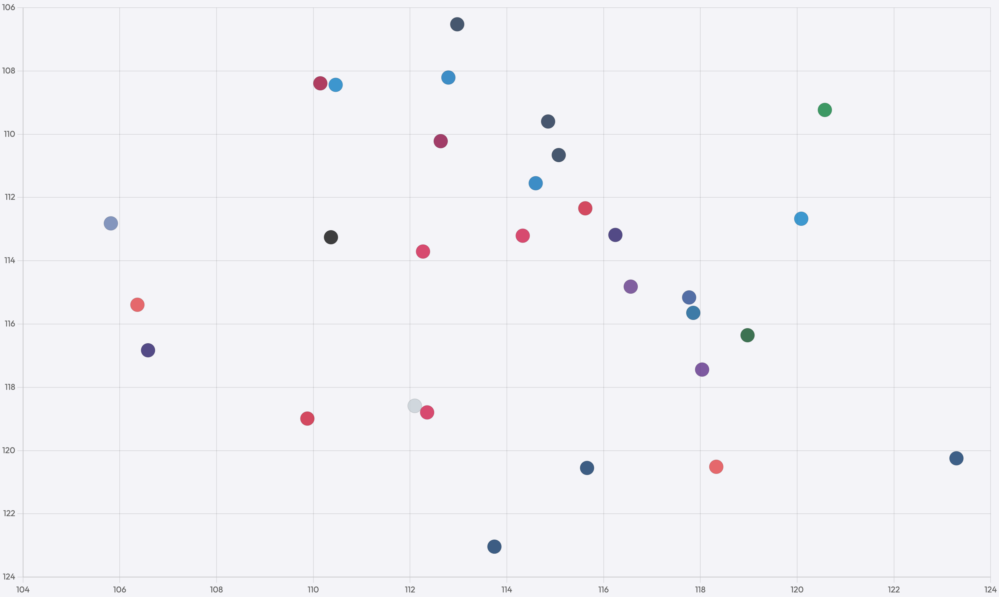
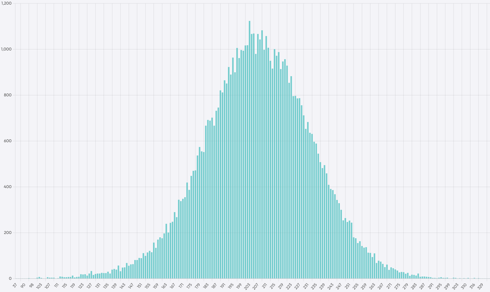
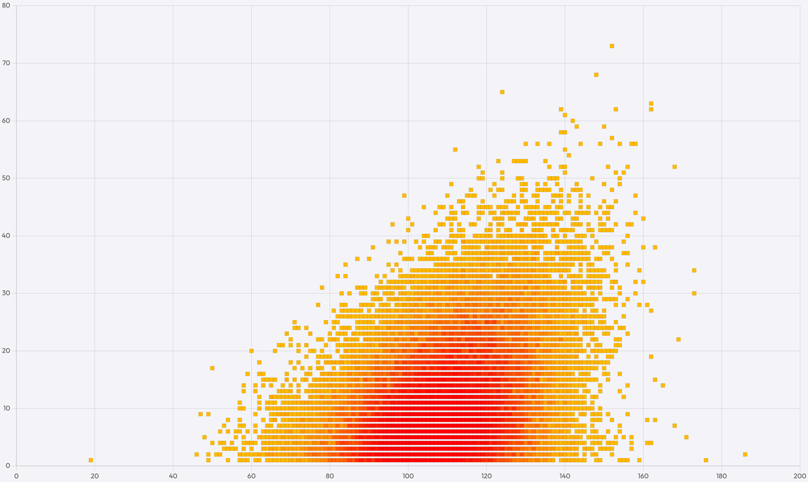

# nba-scoring-analytics

A web application designed to fetch and display NBA game scores as interactive charts. This project focuses on providing users with an intuitive interface to explore NBA game scores for regular season games.



## Features

* __Point Differentials Chart__: Visualizes point differentials for each game of a selected NBA team and season, with green indicating a positive point differential and red indicating negative.
* __Streaks Chart__: Displays the current win or loss streak for a selected NBA team and a season, with green indicating win streaks and red indicating losing streaks.
* __Season Scores Chart__: Plots every score of a selected NBA team in a season.
* __Close Games Shares Chart__: Represents the distribution of close games for a selected NBA team or all teams across a selected season or all seasons, categorized into one possession games, blowouts and moderate leads.
* __Teams Average Points Chart__: Displays the average points scored by each NBA team for a selected season or all seasons.
* __Teams Offense Defense Chart__: Compares the offensive and defensive performance of each NBA team for a selected season or all seasons.
* __Total Points Occurences Chart__: Counts the total occurrences of each score in NBA games for a selected season or all seasons. Each score is calculated by summing the points scored by the winning and losing teams in a game.
* __Scores Heat Map Chart__: Displays a heat map of every NBA game score in history, where the x-axis represents the winning team's score and the y-axis represents the point differential between the winning and losing teams.

## Technologies

* __Frontend__: [React](https://github.com/facebook/react)
* __Backend__: [NestJS](https://github.com/nestjs/nest)
* __Database__: [PostgreSQL](https://www.postgresql.org)
* __Data Fetching__: [nba_api](https://github.com/swar/nba_api)

## Getting Started

In order to run the application, ensure you have installed the following requirements:

- **[Node.js](https://nodejs.org/)**: A runtime environment that allows you to run JavaScript on the server side.
- **[PostgreSQL](https://www.postgresql.org/)**: A powerful open-source relational database management system that provides robust support for handling large volumes of data and complex queries.
- **[Python](https://www.python.org/)**: A versatile programming language known for its simplicity and readability, widely used for various applications ranging from web development to scientific computing.

### Installation

1. **Create a database**: Open a terminal or command prompt on your system and proceed to do the following.

Run PostgreSQL:
```bash
psql
```
Create a database followed by a name:
```sql
CREATE DATABASE postgres;
```

Exit PostgreSQL by running the following:
```bash
\q
```

2. **Clone the Repository**: Start by cloning this repository to your local machine:
```bash
git clone https://github.com/razfrumkin/nba-scoring-analytics.git
```

3. **Navigate to the Client Directory**: Change your working directory to the cloned repository's client:
```bash
cd nba-scoring-analytics/client
```

3. **Install Client Dependencies**: Use npm to install the client's dependencies:
```bash
npm install
```

4. **Build the Client**: Run the following command to build the client.
```bash
npm run build
```

5. **Navigate to the Server Directory**: Change your working directory to the cloned repository's server.
```bash
cd ../server
```

6. **Install Server Dependencies**: Use npm to install the server's dependencies:
```bash
npm install
```

The following dependencies will be installed for the client and the server:
- [typescript](https://www.npmjs.com/package/typescript): TypeScript programming language.
- [ts-node](https://www.npmjs.com/package/ts-node): TypeScript execution environment for development and testing.
- [vite](https://www.npmjs.com/package/vite): Vite build tool for fast development.
- [react](https://www.npmjs.com/package/react): A JavaScript library for building user interfaces, particularly for single-page applications. React allows you to create reusable UI components and manage the application's state efficiently.
- [react-dom](https://www.npmjs.com/package/react-dom): A package that serves as the entry point to the DOM and server renderers for React. It's used alongside React to render React components into the DOM.
- [react-router-dom](https://www.npmjs.com/package/react-router-dom): A React library for adding routing functionality to React applications. It enables navigation between different views or pages within a single-page application.
- [react-query](https://www.npmjs.com/package/react-query): A data fetching library for React applications. React Query simplifies the management of asynchronous data fetching, caching, and synchronization with the UI.
- [sass](https://www.npmjs.com/package/sass): A CSS preprocessor that extends CSS with features like variables, nesting, and mixins. Sass helps streamline the process of writing and maintaining stylesheets for your application.
- [chartjs](https://www.npmjs.com/package/chartjs): A JavaScript library for creating various types of charts and graphs, such as bar charts, line charts, and pie charts. It's used in your project for chart visualization.
- [react-chartjs-2](https://www.npmjs.com/package/react-chartjs-2): A React wrapper for ChartJS, providing React components that make it easy to integrate Chart.js into your React application.
- [nest](https://www.npmjs.com/package/@nestjs/core): A powerful Node.js framework known for its modularity and TypeScript support. It simplifies building server-side applications with features like controllers, services, and middleware.
- [jest](https://www.npmjs.com/package/jest): A JavaScript testing framework for Node.js applications, used for writing unit tests, integration tests, and end-to-end tests in NestJS applications.

7. **Create a .env File Inside the Server Directory**: Inside the .env file specify the port which you want the app to run on and the name of the database you've created earlier.
```
PORT=3000
POSTGRES_NAME=postgres
```

8. **Run the Server**: Start the server by running the following command.
```bash
npm run dev
```

9. **Navigate to the Server Scripts Directory**: Change your working directory to the scripts directory.
```bash
cd scripts
```

10. **Python Setup**: Ensure Python 3 and pip are installed. Then create a virtual environment.
```bash
python3 -m venv venv
```

11. **Activate the Virtual Environment**: By activating the virtual environment, you ensure that any Python-related commands you execute will use the dependencies installed within the virtual environment, providing a clean and isolated environment for your project.

```bash
# unix
source venv/bin/activate

# windows
venv\Scripts\activate
```

12. **Install Python Packages** Install the required Python packages.
```bash
pip3 install -r requirements.txt
```

The following dependencies will be installed for the Python scripts:
- [python-dotenv](https://pypi.org/project/python-dotenv): Manages environment variables in Python projects using a .env file, allowing you to easily configure your application without hardcoding sensitive information.
- [psycopg2-binary](https://pypi.org/project/psycopg2-binary): A PostgreSQL adapter for Python, enabling Python code to interact with PostgreSQL databases by executing SQL queries, managing connections, and handling transactions.
- [nba_api](https://pypi.org/project/nba_api/1.1.9/): A Python library that provides an interface for accessing data from the NBA Stats API, allowing users to retrieve a wide range of NBA-related data, including game scores, player stats, and team information.

13. **Fetch and Persist the Data**: This script fetches NBA data, saves it into JSON, then persists it to the database. This may take a couple minutes.
```bash
python3 script.py setup
```

14. **Enjoy the Application**: Once the setup is complete, you can start exploring NBA game scores and statistics right away! Simply open your web browser and navigate to localhost:\<PORT> to access the application. From there, you can interact with the various charts and features to delve into the world of NBA scoring analytics.

## Screenshots

<p>
    
    
    
    
    
    
    
    
</p>